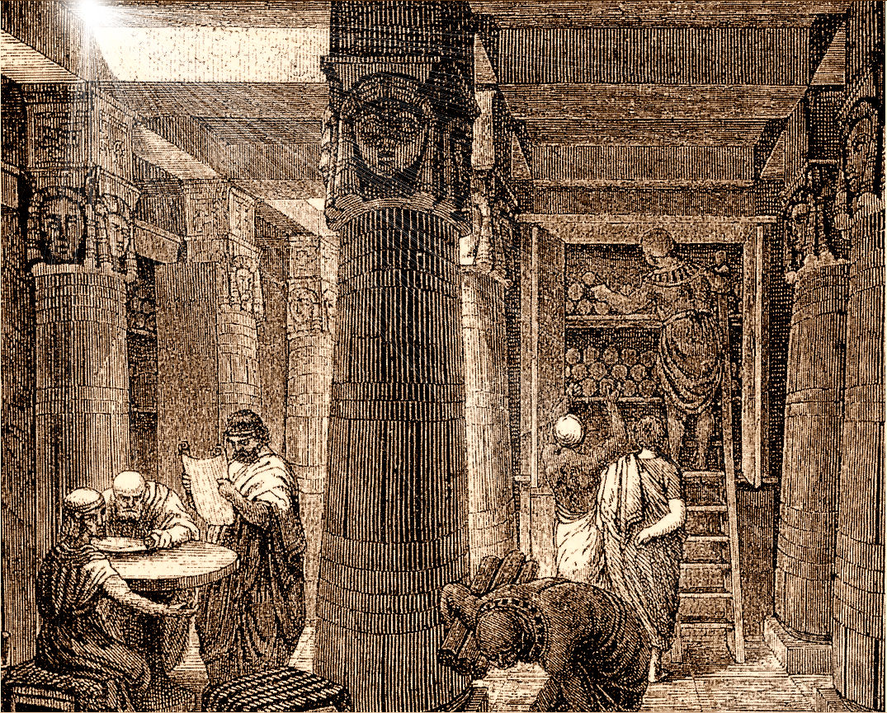

# Phantas0s's Alexandria Library

> The opportunity before all of us is living up to the dream of the Library of Alexandria and then taking it a step further - universal access to all knowledge. Interestingly, it is now technically doable. -- **[Brewster Kahle](https://en.wikipedia.org/wiki/Brewster_Kahle)** 

Hello and welcome to my personal Alexandria Library!

You'll find here the result of my insatiable thirst of knowledge, mainly in the form of [mindmaps](https://en.wikipedia.org/wiki/Mind_map) (but not only).

To enter the library, you'll need the software [Freemind](http://freemind.sourceforge.net/wiki/index.php/Main_Page) installed on your shiny computer.

## What is it for?

As far as I remember, I always liked reading books. However, very quickly, I found that it was difficult for me to recall what I learned, in my attempts to explain and share my discoveries. What was the point to read, then?

It could have easily discouraged me to open books again; instead, I tried to find a solution to retain the knowledge of my favorite authors. Some years ago, after trying many techniques, I discovered mindmaps and the fantastic freeware [Freemind](http://freemind.sourceforge.net/wiki/index.php/Main_Page).

Quickly, I began to write mindmaps of everything interesting I was reading or watching. These mindmaps (and other resources) constitute now my [Alexandria Library](https://en.wikipedia.org/wiki/Library_of_Alexandria).

## Why Mindmaps?

I believe that creating a system to capture and retain knowledge is something utterly personal. It should be the result of personal experimentations. Everybody's different, therefore everybody should find and apply the best methods he sees fit to expend his knowledge and to transfer it in other activities.

Mindmaps allow me to:

1. Capture knowledge fairly quickly, especially since Freemind can be controlled with [Vim](https://www.vim.org)-like keystrokes. For more information, you can try my [Freemind config files](https://github.com/Phantas0s/.dotfiles/blob/master/install/install-freemind.sh).
2. Mindmaps offer a very visual way to access any part of any resource quickly, by localizing the branches I'm interested in.
3. I can easily add annotations, questions, or even links on a mindmap.

I like trees, I love mindmaps. For me, it's a fun way to capture knowledge. Whatever system you choose, I advise you to use something you like doing, or you won't do it!

Finally, it's way easier to get back to some precise content I previously read or watched using mindmaps, instead of opening a book or a video and trying to localize the content I'm seeking.

## My Method To Retain and Capture Knowledge

> An investisment in knowledge always offer the best interest. -- **Benjamin Franklin**

It might seem like a lot of work, but I've got pretty effective following this process:

1. When I read a book or an article which looks interesting, I take detailed notes while reading, on a small notebook. This first phase help me to remember roughly what the content is about.
2. When I finished the source, I copy my note into a mindmap. Again, it helps me keep the knowledge in my long term memory.
3. I review my mindmaps once in a while. Being able to hide some branches allow me to test myself, to see if I remember the subject. I can as well add questions on the central node and I try to answer them. My review process can vary grandly depending on the knowledge itself. 

The first two points aim to capture knowledge, 95% of the retention occurs during the third step.

## Disclaimer

### Personal Knowledge

The mindmaps and other resources from this library are tailored to my knowledge and my personality. Therefore, even if I capture content in a detailed way, I can sometimes elude some parts, for different reasons.

Most of the time, I'm trying to avoid these traps:

* Personal judgements
* Understanding mistakes

However, I'm a human being. There are mistakes and misconceptions in my mindmaps.

Again, because of the personal nature of this library, you'll find some mindmaps hard to read, or even totally obscure. It's not because I think you're stupid (you're not), but because you're not me and, ultimately, I'm not you.

### My Mindmaps are Just Pale Copies

If you find some mindmaps interesting, I invite you to read (or watch) the original source. You'll get way more out of it.

### Copyright

If you're the writer of the original content and you don't want me to put online a copy of your work for free, let me know and I will remove it.

### Spelling, Syntax, and Grammar

I'm not a native English speaker. Don't be surprised to see many spelling or grammar mistakes in the library.

## Why Sharing?

I share my library for:

1. Inspiring anybody who try to learn and capture knowledge.
2. Share the content I find interesting for you to read the original source. My mindmaps can give you an idea of the source.

## Contribution

I won't accept any contribution concerning the content or the organization of my mindmaps. 

However, if you have any suggestion to capture or retain knowledge, or if you see any spelling mistakes (there are many!), feel free to open a pull request.

## Licence

[Apache Licence 2.0](https://choosealicense.com/licenses/apache-2.0/)

