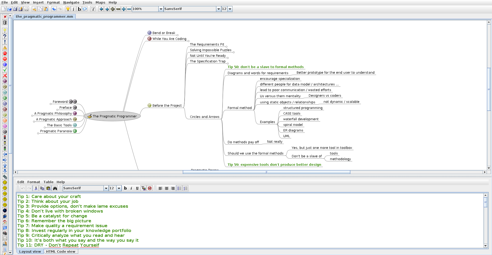

# The Alexandria Library


[]()

> The opportunity before all of us is living up to the dream of the Library of Alexandria and then taking it a step further - universal access to all knowledge. Interestingly, it is now technically doable. -- **[Brewster Kahle](https://en.wikipedia.org/wiki/Brewster_Kahle)** 

Welcome to The Alexandria Library!

You'll find here the result of my insatiable thirst of knowledge, mainly in the form of [mindmaps](https://en.wikipedia.org/wiki/Mind_map) (but not only).

## How does it look like?

To open the mindmaps, you'll need the software [Freemind](http://freemind.sourceforge.net/wiki/index.php/Main_Page). It looks like that:

[](https://raw.githubusercontent.com/Phantas0s/alexandria-library/master/example.png)

The center is the name of the source. Often, it will be a book, an article, or a video. Then, the first level of branches will be the chapters. Every branch level goes deeper into the knowledge.

## What is it for?

As far as I remember, I always liked reading books. Yet, it was difficult for me to recall what I learned in my attempts to share my discoveries. What was the point to read, then?

From there, I tried to find solutions to retain the knowledge of my favorite authors. Some years ago, after experiments and failures, I discovered mindmapping and the fantastic open-source software [Freemind](http://freemind.sourceforge.net/wiki/index.php/Main_Page).

Quickly, I began to write mindmaps of everything interesting I was reading or watching. These mindmaps (and other resources) constitute now my [Alexandria Library](https://en.wikipedia.org/wiki/Library_of_Alexandria).

## Why Mindmaps?

> Invest regularly in your knowledge portfolio. -- **The Pragmatic Programmer**

This choice is based on experiments I've done. I remember more of the content I'm consuming if I create mindmaps, and it's easy to go back to a mindmap to find *exactly* the knowledge I need.

Therefore, it's a personal choice. If you're interested to create a "second brain", you should do some experiments too and see what works for you. 

These mindmaps allow me to:

1. Capture the knowledge fairly quickly, especially because Freemind can be controlled with [Vim](https://www.vim.org)-like keystrokes. For more information, you can try my [Freemind config files](https://github.com/Phantas0s/.dotfiles/blob/master/install/install-freemind.sh).
2. Have a visual way to access any part of any resource quickly, by localizing the branches I'm interested in.
3. Add annotations, questions, or even links on a mindmap.

I like trees, I love mindmaps. For me, it's a fun way to capture knowledge. Whatever system you choose, I advise you to use something you like doing, or you won't do it.

Additionally, these mindmaps are in XML. Since my [development environment is centered around the shell](https://themouseless.dev), I've many tools to search through plain text. As a result, I can find the exact mindmap I need easily.

Finally, it's way easier to get back to some precise content I previously read or watched using mindmaps, instead of opening a book or a video and trying to localize the content I'm seeking.

## My Method To Retain and Capture Knowledge

> An investment in knowledge always offer the best interest. -- **Benjamin Franklin**

It might seems like a lot of work, but I've got pretty effective following this process:

1. When I read a book or an article which looks interesting, I take detailed notes while reading, on a small notebook. This first phase help me to remember roughly what the content is about.
2. When I finished the source, I copy my notes into a mindmap. Again, it helps me to transfer the knowledge in my long term memory.
3. I review my mindmaps once in a while, often depending on my real-life goals. For more abstract knowledge, I refresh them sometimes by testing what I remember. Being able to hide some branches helps a lot. I can as well add questions on the root node, and I try to answer them. My review process can vary grandly depending on the knowledge itself.

The first two points aim to capture the knowledge. The third point helps me to put the knowledge in my long term memory, to be able to use it quickly.

## Icons and Meaning

I use icons on some nodes to carry some meaning:

* Numbers: show the order of reading, which follows the flow of the source material.
* Green flower: This node expands to an image.
* Magical wand: example to illustrate the idea, from the source.
* Key: Personal comment.

## Disclaimer

### Personal Knowledge

The mindmaps and other resources from this library are tailored to my knowledge and my personality. Therefore, even if I capture content in a detailed way, I can sometimes elude some parts, for different reasons.

Most of the time, I'm trying to avoid these traps:

* Personal judgments.
* Understanding mistakes.
* Biases (especially confirmation bias).

I'm pretty sure there are a ton of them.

Again, because of the personal nature of this library, you'll find some mindmaps hard to read, or even totally obscure. It's not because I think you're stupid (you're not), but because you're not me and, ultimately, I'm not you.

Are we?

### My Mindmaps are Just Pale Copies

If you find some mindmaps interesting, I invite you to read (or watch) the original source. You'll get **WAY more** out of it.

### Copyright

If you're the writer of the original content and you don't want me to put online my notes on it, let me know and I will remove them.

### Spelling, Syntax, and Grammar

I'm not a native English speaker. Don't be surprised to see many spelling or grammar mistakes in the library, or in this README.

## Why Sharing That?

In order to:

1. Inspire anybody who try to learn and capture knowledge.
2. Share the content I find interesting, for you to read the original source. My mindmaps can give you an idea of the source.

## Questions? Feedback?

I love questions! I love feedback! Don't hesitate to [contact me](https://thevaluable.dev/page/about/).

## Contribution

I won't accept any contribution concerning the content or the organization of my mindmaps.

However, if you have any suggestion to capture or retain knowledge, or if you see any spelling mistakes, feel free to open a pull request.

## Licence

[Apache Licence 2.0](https://choosealicense.com/licenses/apache-2.0/)
```bash
.
├── business
│   ├── business_authority_ask_us_anything_2.mm
│   ├── business_authority_ask_us_anything_3.mm
│   ├── business_authority_ask_us_anything.mm
│   ├── business_profit_101_freelance_developer.mm
│   ├── carreer_management_2_0
│   │   └── career_management_2_0.mm
│   ├── choosing_consulting_project_give_energy.mm
│   ├── consulting
│   │   ├── anti_pattern_laboring_strategist.mm
│   │   ├── becoming_software_consultant.mm
│   │   ├── best_questions_ask_consulting_client.mm
│   │   ├── consultancy_for_developers.mm
│   │   ├── consulting_blueprint.mm
│   │   ├── consulting_skills_you_need_without_the_vague_platitudes.mm
│   │   ├── consulting_success.mm
│   │   ├── escaping_execution.mm
│   │   ├── how_to_become_a_management_consultant.mm
│   │   ├── how_to_start_consultancy_business
│   │   │   └── how_to_start_consultancy_business.mm
│   │   ├── making_the_leap_to_consulting.mm
│   │   ├── positioning_strategy_for_the_aspiring_consultant.mm
│   │   ├── positioning_yourself_to_coworkers_as_a_stealth_consultant.mm
│   │   ├── stop_posturing_to_your_peers.mm
│   │   ├── the_secret_of_consulting
│   │   │   └── the_secret_of_consulting.mm
│   │   ├── web_consultant_web_developer.mm
│   │   ├── when_to_systematize.mm
│   │   └── why_client_doesnt_take_decision_save_money.mm
│   ├── crossing_river_feeling_stones
│   │   └── crossing_river_feeling_stones.mm
│   ├── dealing_with_chaos.mm
│   ├── designing_ideal_bootstrapping_business.mm
│   ├── e-myth_revisited
│   │   └── e_myth_revisited.mm
│   ├── five_ways_to_specialize.mm
│   ├── freelancing
│   │   ├── better_freelance_business_in_2019.mm
│   │   ├── book_yourself_solid.mm
│   │   ├── ditching_hourly.mm
│   │   ├── firing_client.mm
│   │   ├── fixed_bids_vs_hourly_hours.mm
│   │   ├── freelance_wrong-questions.mm
│   │   ├── getting_started_with_freelancing.mm
│   │   ├── how_to_attract_clients_without_doing_sell.mm
│   │   ├── keeping_the_pipeline_full.mm
│   │   ├── making_money_from_open_source.mm
│   │   ├── positioning.mm
│   │   ├── setting_your_rates.mm
│   │   ├── starting_freelancing_as_an_employee.mm
│   │   └── the_freelancer_primer.mm
│   ├── getting_best_answers.mm
│   ├── getting_real.mm
│   ├── how_find_business_ideas_customer_want.mm
│   ├── how_to_brainstorm_great_project_ideas.mm
│   ├── how_to_find_100x_valuable_customer.mm
│   ├── how_to_measure_anything
│   │   ├── how_to_measure_anything.mm
│   │   └── resources
│   ├── how_to_speak_to_business_leader.mm
│   ├── if_your_innovation_effort_isnt_working_look_at_who_on_the_team.mm
│   ├── i_hate_mvp_so_do_your_customers
│   │   └── i_hate_mvp_so_do_your_customers.mm
│   ├── jason_cohen_interview.mm
│   ├── magic_the_gathering_twenty_years_twenty_lesson_learned.mm
│   ├── marketing
│   │   ├── 17_link_building_strategy.mm
│   │   ├── 5_ways_you_can_make_money_with_your_personnal_brand.mm
│   │   ├── content_marketing_strategies.mm
│   │   ├── developing_linkbait_for_a_non_technical_audience.mm
│   │   ├── human_email_automation.mm
│   │   ├── _INFOGRAPHICS
│   │   ├── keyword_difficulty.mm
│   │   ├── marketing_mindset.mm
│   │   ├── marketing_selling_own_product_service
│   │   │   └── marketing_selling_own_product_service.mm
│   │   ├── perfect_about_page.mm
│   │   ├── SEO
│   │   │   └── the_big_book_of_getting_people_to_link_to_you.mm
│   │   ├── seo_moz.com.mm
│   │   ├── strategic_seo_for_startups.mm
│   │   └── what_is_lead_generation
│   │       └── what_is_lead_generation.mm
│   ├── metrics
│   │   └── tyranny_of_metrics.mm
│   ├── nacked_business_how_honesty_makes_you_more_money.mm
│   ├── networking
│   │   ├── informational_interview.mm
│   │   └── networking_for_people_who_hate_networking.mm
│   ├── niche
│   │   ├── choosing_an_unconventional_niche.mm
│   │   ├── choosing_a_speciality.mm
│   │   ├── dont_pick_nich_discover_them.mm
│   │   ├── how_to_pick_a_niche_start_listening_to_other_people.mm
│   │   ├── market_research_call_identify_validate_niche.mm
│   │   └── niching_down.mm
│   ├── personal_brand
│   │   └── developing_your_personal_brand
│   │       └── developing_your_personal_brand.mm
│   ├── positioning_for_soloists.mm
│   ├── psychology
│   │   └── playing_long_game_entrepreneurship_sustainable.mm
│   ├── revenue_streams
│   │   ├── 1000_true_fans.mm
│   │   ├── 9_perfect_products_for_dev.mm
│   │   ├── building_new_revenue_streams.mm
│   │   └── hack_your_career.mm
│   ├── rework.mm
│   ├── saas_startup
│   │   ├── a_software_business_five_hours_a_week.mm
│   │   ├── creating_a_business_that_can_thrive_without_you.mm
│   │   ├── epic_guide_bootstrapping_startup_by_yourself.mm
│   │   ├── from_productized_service_to_saas.mm
│   │   ├── how_to_evaluate_your_startup_idea
│   │   │   └── how_to_evaluate_startup_idea.mm
│   │   ├── pros_and_cons_building_saas.mm
│   │   └── quick_dirty_guide_startup_brand.mm
│   ├── sales
│   │   └── why_we_still_need_to_sell.mm
│   ├── setting_up_your_ecosystem.mm
│   ├── signs_your_message_is_not_working.mm
│   ├── _STUDIES
│   ├── survey
│   │   └── conducting_stakeholder_interview_survey.mm
│   ├── taking_risk.mm
│   ├── the_efficiencer.mm
│   ├── theory_of_constraints
│   │   └── theory_of_constraint_101.mm
│   ├── the_passion_economy.mm
│   ├── the_trusted_advisor_follow_up.mm
│   ├── the_trusted_advisor.mm
│   ├── the_why_conversation.mm
│   ├── training
│   │   ├── create_or_sell_an_online_course.mm
│   │   └── frelancer_show_-_303_genesis_of_a_course.mm
│   ├── uncovering_your_big_idea.mm
│   └── what_i_learned_cofounding_dribble.mm
├── computing
│   ├── analysis
│   │   ├── software_design_x_ray
│   │   │   └── software_design_x_ray.mm
│   │   └── your_code_as_a_crime_scene
│   │       └── your_code_as_a_crime_scene.mm
│   ├── api
│   │   ├── graphql_grpc_or_rest
│   │   │   └── graphql_grpc_or_rest.mm
│   │   ├── how_to_design_good_api.mm
│   │   ├── REST
│   │   │   ├── _ANNOTATED
│   │   │   └── rest.mm
│   │   └── rest_vs_rpc.mm
│   ├── architecture
│   │   ├── building_evolutionary_architecture
│   │   │   └── building_evolutionary_architecture.mm
│   │   ├── ddd_quickly
│   │   │   └── ddd.mm
│   │   ├── design_composition_performance.mm
│   │   ├── implementing_domain_driven_design
│   │   │   └── implementing_domain_driven_design.mm
│   │   ├── _PAPERS
│   │   │   └── _ANNOTATED
│   │   ├── strategic_design_evans.mm
│   │   └── the_most_important_design_guideline.mm
│   ├── computer_science
│   │   ├── 00_introduction
│   │   │   └── uc_berkeley_cs10_2010
│   │   │       ├── 08_concurency
│   │   │       │   └── concurency.mm
│   │   │       └── 13_applications_that_changed_the_world.mm
│   │   ├── 01_programming
│   │   │   └── sicp
│   │   │       ├── berkeley_cs61a
│   │   │       │   ├── above_line_view.mm
│   │   │       │   ├── below_line_view.mm
│   │   │       │   └── scheme_class_61A.mm
│   │   │       └── book
│   │   │           ├── order_of_growth
│   │   │           └── sicp.mm
│   │   ├── 03_algorithm_data_structure
│   │   │   └── algorithm_data_structure.mm
│   │   ├── 04_mathematics
│   │   │   ├── concrete_mathematics
│   │   │   │   └── concrete_mathematics.mm
│   │   │   ├── discrete_mathematics_and_its_application
│   │   │   │   ├── discrete_mathematics_and_its_applications.mm
│   │   │   │   └── solutions
│   │   │   ├── discrete_math_you_need_to_know.mm
│   │   │   └── mit_mathematics_for_computer_science
│   │   │       └── mit_mathematics_for_computer_science.mm
│   │   ├── 06_computer_networking
│   │   │   └── computer_networking_top_down_approach
│   │   │       ├── computer_networking.mm
│   │   │       └── Wireshark Labs
│   │   │           └── Kurose_Ross_Wireshark_labs_7th_ed
│   │   ├── oral_history_john_mc_carthy.mm
│   │   └── power_abstraction_liskov.mm
│   ├── database
│   │   ├── how_does_a_relational_database_works.mm
│   │   └── _INFOGRAPHICS
│   ├── data_science
│   │   └── data_warehouse.mm
│   ├── devops
│   │   ├── 9_metrics_that_can_make_a_difference.mm
│   │   ├── accelerate
│   │   │   └── accelerate.mm
│   │   ├── kubernetes_basics
│   │   │   └── official_kubernetes_tutorial.mm
│   │   ├── stress_free_game_development_with_devops
│   │   │   └── stress_free_game_development_with_devops.mm
│   │   └── _STUDIES
│   ├── distributed_systems
│   ├── game
│   │   └── webgl_fundamentals
│   │       └── webgl_fundamentals.mm
│   ├── git
│   │   └── pro_git
│   │       └── pro_git.mm
│   ├── hardware
│   ├── _INFOGRAPHICS
│   │   └── vim
│   │       └── cheatsheets
│   ├── languages
│   │   ├── bash
│   │   │   └── _CHEATSHEETS
│   │   ├── clojure
│   │   │   ├── agility_robustness_spec
│   │   │   │   └── agility_and_robustness_clojure_spec.mm
│   │   │   ├── clojure_for_the_brave_and_true
│   │   │   │   └── clojure_for_the_brave_and_true.mm
│   │   │   └── modern_cljs.mm
│   │   ├── golang
│   │   │   ├── advanced_testing_with_go_by_mitchell_hashimoto.mm
│   │   │   ├── concurency_in_go.mm
│   │   │   ├── concurency_is_not_parallelism.mm
│   │   │   ├── delve_talk_-_go_internal.mm
│   │   │   ├── design_command_line_tool_people_love
│   │   │   │   └── design_command_line_tool_people_love.mm
│   │   │   ├── design_philosophy
│   │   │   │   └── design_philosophy.mm
│   │   │   ├── go_beautiful_package.mm
│   │   │   ├── go_in_action.mm
│   │   │   ├── go_scheduler
│   │   │   │   └── go_scheduler.mm
│   │   │   ├── introduction_to_interfaces
│   │   │   │   └── introduction_to_interfaces.mm
│   │   │   ├── language_mechanics
│   │   │   │   └── language_mechanics.mm
│   │   │   └── static_analysis_in_go.mm
│   │   ├── lisp
│   │   │   └── recursive_mc_carthy.mm
│   │   ├── lua
│   │   └── php
│   │       ├── marco_pivetta_doctrine_orm_good_practices_and_tricks.mm
│   │       └── symfony_con_2016
│   ├── misc
│   │   ├── being_good_is_overrated.mm
│   │   ├── building_highly_reliable_websites_for_small_companies.mm
│   │   ├── dan_ingalls_oop.mm
│   │   ├── dont_call_yourself_a_programmer_and_other_career_advice.mm
│   │   ├── engineering_you.mm
│   │   ├── fp_high_school_algebra
│   │   ├── how_to_think_like_a_programmer.mm
│   │   ├── implementing_a_strong_code_review_culture.mm
│   │   ├── lean_code
│   │   │   └── lean_code.mm
│   │   ├── learn_to_impact_the_business_as_a_developer.mm
│   │   ├── math_for_programmers
│   │   │   └── math_for_programmer.mm
│   │   ├── old_is_the_new_new.mm
│   │   ├── on_abstraction.mm
│   │   ├── programming_across_paradigms
│   │   │   └── programming_across_paradigms.mm
│   │   ├── requirement_example
│   │   ├── secret_growing_your_engineering_carreer_if_you_don_t_want_to_manage.mm
│   │   ├── simple_made_easy
│   │   │   └── simple_made_easy.mm
│   │   ├── taking_back_software_engineering
│   │   │   └── taking_back_software_engineering.mm
│   │   ├── the_pragmatic_programmer
│   │   │   └── the_pragmatic_programmer.mm
│   │   ├── things_that_matters.mm
│   │   └── unicode_character_set
│   │       └── unicode_character_set.mm
│   ├── network
│   ├── _PAPERS
│   │   ├── _ANNOTATED
│   │   ├── code_review
│   │   ├── communication
│   │   ├── concurrency
│   │   ├── dev_tools
│   │   ├── hardware
│   │   ├── inheritance
│   │   │   └── _ANNOTED
│   │   ├── measuring_complexity
│   │   │   ├── aging_decay
│   │   │   ├── _ANNOTATED
│   │   │   ├── change
│   │   │   │   └── _ANNOTATED
│   │   │   ├── cognition
│   │   │   │   └── _ANNOTATED
│   │   │   ├── readibility
│   │   │   ├── requirements
│   │   │   ├── sentiments
│   │   │   │   └── _ANNOTATED
│   │   │   ├── social
│   │   │   │   └── _ANNOTATED
│   │   │   ├── technical_debt
│   │   │   │   ├── _ANNOTATED
│   │   │   │   └── _MINDMAPS
│   │   │   │       ├── 2019_examination_tools_managing_different_dimensions_technical_debt.mm
│   │   │   │       ├── 2019_software_productivity_loss_due_technical_debt.mm
│   │   │   │       └── 2021_overview_comparison_technical_debt_measurement_tool
│   │   │   │           └── 2021_overview_comparison_technical_debt_measurement_tool.mm
│   │   │   └── tools
│   │   │       └── _ANNOTATED
│   │   ├── mouseless
│   │   │   ├── _ANNOTATED
│   │   │   └── thebluedragons
│   │   ├── paradigms
│   │   │   └── _ANNOTATED
│   │   ├── programming_languages
│   │   │   └── lua
│   │   ├── soft_skills
│   │   │   └── _ANNOTATED
│   │   ├── testing
│   │   └── type
│   │       └── abstract_data_type
│   │           └── _ANNOTATED
│   ├── shell
│   │   ├── better_bashing_through_technology.mm
│   │   ├── cli_design_best_practice.mm
│   │   ├── refactoring_in_bash_functions.mm
│   │   ├── terminal_io
│   │   ├── the_awk_programming_language.mm
│   │   └── zsh.mm
│   ├── _SLIDES
│   ├── technical_interviewing_you_doing_it_wrong.mm
│   └── vim
│       ├── cutomizing_vim
│       │   └── customizing_vim.mm
│       ├── nvim_lua_guide.mm
│       ├── practical_vim.mm
│       ├── user_manual.mm
│       ├── vim_ide.mm
│       └── vimscript
│           └── vimscript_the_hard_way
│               └── I_vimscript_the_hard_way.mm
├── design
│   ├── color_theory.mm
│   ├── _INFOGRAPHICS
│   ├── photoshop_blend_modes.mm
│   └── pixel_art_tutorial_complete_guide.mm
├── economics
│   └── freakonomics.mm
├── _githooks
├── health
│   └── _INFOGRAPHICS
├── _IN_PROGRESS
│   ├── introduction_to_computer_networking
│   │   └── introduction_to_computer_networking.mm
│   └── magic_trick_of_testing.mm
├── languages
│   ├── Deutsch
│   │   ├── dfe.mm
│   │   ├── german.mm
│   │   ├── infographics
│   │   └── netzwerk_solutions
│   └── English
│       ├── infographics
│       └── ommiting_that.mm
├── management
│   ├── okr_agile_stop_waterfall_goals
│   │   └── okr_and_agile_stop_waterfall_goals.mm
│   ├── _PAPERS
│   └── patterns_of_effective_teams.mm
├── mathematics
│   ├── general_mathematics.mm
│   └── introduction_to_mathematical_thinking
│       └── introduction_to_mathematical_thinking.mm
├── philosophy
│   ├── fallacies.mm
│   └── _INFOGRAPHICS
├── photography
│   ├── camera_sensors.mm
│   ├── infographics
│   └── photography_business_elia_locardi.mm
├── productivity
│   ├── action_mindmap_system
│   ├── _INFOGRAPHICS
│   ├── productivity_not_time_management_but_attention_management.mm
│   └── work_less_get_more_done_analytics_for_maximizing_productivity.mm
├── public_speaking
│   └── _INFOGRAPHICS
├── self_improvement_psychology
│   ├── 3_tactics_against_procrastination.mm
│   ├── beyond_burnout_how_to_work_hard_and_enjoy_life.mm
│   ├── emotional_intelligence
│   │   └── emotional_intelligence.mm
│   ├── how_to_be_successful.mm
│   ├── how_to_win_friend_and_influence_people.mm
│   ├── _INFOGRAPHICS
│   ├── just_listen_how_to_reach_anyone.mm
│   ├── laziness_does_not_exist.mm
│   ├── mental_models
│   │   └── mental_models.mm
│   ├── _PAPERS
│   │   ├── burnout
│   │   ├── cognitive_load_theory
│   │   ├── communication
│   │   │   └── _ANNOTATED
│   │   ├── feedback
│   │   ├── imposter_syndrome
│   │   │   └── _ANNOTATED
│   │   ├── informal_logic
│   │   │   └── _ANNOTATED
│   │   ├── soft_skills
│   │   │   └── _ANNOTATED
│   │   └── stress
│   │       └── _ANNOTATED
│   ├── psychology_of_focus.mm
│   ├── the_willpower_instinct.mm
│   ├── we_are_all_confident_idiots.mm
│   └── zen_body_being.mm
├── statistics
│   └── head_first_statistics
│       └── head_first_statistics.mm
├── system
│   └── introduction_to_system_thinking
│       └── introduction_to_system_thinking.mm
├── teaching_learning
│   ├── 10_lessons_mit_education.mm
│   ├── a_mind_for_numbers.mm
│   ├── how_to_speak.mm
│   ├── memory_unlimited.mm
│   ├── _PAPERS
│   │   └── _ANNOTATED
│   ├── the_science_of_accelerated_learning.mm
│   └── ultralearning.mm
└── writing
    ├── 11_reasons_people_bounce_from_your_blog_and_never_return.mm
    ├── blogging
    │   ├── blogging_guide.mm
    │   ├── blog_topic_planning.mm
    │   ├── great_blog_post.mm
    │   ├── how_to_produce_killer_content.mm
    │   ├── refreshing_your_blog_posts.mm
    │   └── this_is_our_fist_post_and_other_title_you_should_not_publish.mm
    ├── keys_to_great_writing
    │   └── keys_to_great_writing.mm
    ├── on_writing_well.mm
    ├── _SLIDES
    ├── write_to_express_not_to_impress.mm
    └── writing_is_thinking_learning_to_write_with_confidence.mm

212 directories, 241 files
```
